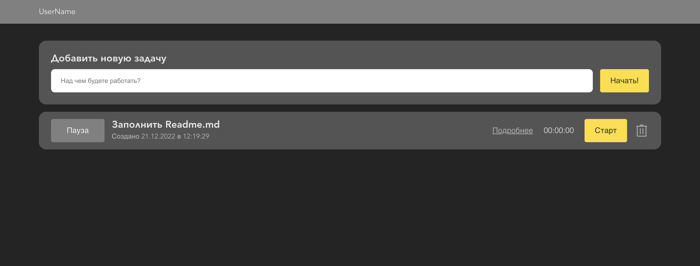
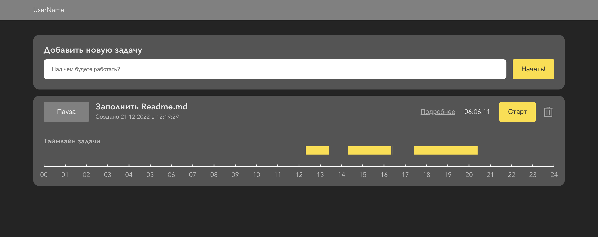

# Simple timetracker app #
Pet-project of SPA for tracking time of your tasks

### Used tech stack: ###
- TypeScript, as base language
- React JS, as frontend library
- Redux, as a state-management library
- SCSS, for styles

### Main small features :) : ###
- Add and remove tasks:

- Look at detailed information with simple graphics and total time

